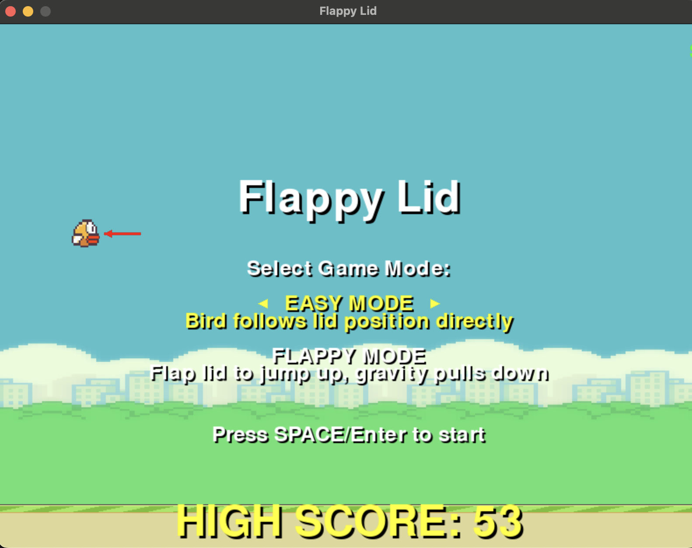

# Flappy Lid 🐦

## ⚠️ Disclaimer

This is a **parody** game. I am not responsible for any damage caused by:
- Getting addicted to opening and closing your laptop 
- Your MacBook breaking from aggressive gameplay
- Friends judging you for playing a game controlled by your laptop lid
- Existential crisis from realizing this probably shouldn't exist

**By playing this game you acknowledge that this is a very stupid idea.**

---

## What Is This?

A Flappy Bird clone controlled by your MacBook's lid sensor. Because apparently that's where we are in 2025.



### Features
- 🐦 Animated bird that flaps
- 🟢 Green pipes that hate you
- 🌈 Rainbow effects for achievements
- 🎊 Confetti at 100 points (good luck)
- 💾 High score tracking
- 🎵 Sound effects
- 📱 Proportional lid sensor control
- 🎮 Two game modes: Easy & Flappy
---

## Installation

```bash
pip3 install --break-system-packages pygame pybooklid
python3 flappy_lid.py
```
Yes, we're here to break system packages, not create sustainable system environments. Come at me PEP 668.
---

## How To Play

### Game Modes
- **Easy Mode**: Bird follows lid position directly
- **Flappy Mode**: Flap lid to jump up, gravity pulls down
- **LEFT/RIGHT arrows** = Select mode on menu (I could've made it up/down, but that'd make too much sense)
- **SPACE** = Start with selected mode

### Controls

#### Easy Mode
- **Open MacBook lid** = Bird goes up ⬆️
- **Close MacBook lid** = Bird goes down ⬇️

#### Flappy Mode  
- **Small lid flap** (1-10°) = Small hop
- **Medium lid flap** (20-40°) = Medium jump
- **Big lid flap** (60-80°) = Big jump  
- **HUGE lid flap** (80-100°) = Maximum jump
- **Hold SPACE** = Dive faster ⬇️

#### Universal
- **SPACE** = Start/restart
- **ESC** = Quit

### Achievements
- **10, 20, 30 points** 🌈 - Rainbow score display
- **50 points** 🌈💥 - Enlarged pulsing score  
- **100 points** 🎊 - Confetti explosion + "LEGENDARY" status

---

## Troubleshooting

**"Sensor Not Available"**: Your MacBook might not support the lid sensor. The game will use keyboard controls (arrow keys) as fallback.

**Too Hard**: That's the point. It's extremely difficult by design. Try Easy Mode first.

**Jittery Movement**: Try cleaning your MacBook hinges or accept the chaos.

**Flappy Mode Too Sensitive**: Start with gentle 10-20° movements, work up to bigger flaps.

**Can't Control Descent**: Hold SPACE in Flappy Mode to dive faster.

---

## Contributing

...please don't.

---


---

## Contacting Me

...please don't. But if you make a gif/video of you playing this, I'll put it in the README. I'm not recording myself playing this.

---

## Legal

MIT License. Flappy Bird assets from [official repository](https://github.com/samuelcust/flappy-bird-assets).

This is a parody/educational project. No birds were harmed.

---

## Credits

This world-changing masterpiece was only made possible by the groundbreaking contributions of:

- **[@samhenrigold/LidAngleSensor](https://github.com/samhenrigold/LidAngleSensor)** - The original discoverer of the MacBook lid angle sensor. Without this revolutionary breakthrough, humanity would still be stuck using keyboards and mice like savages. Truly the Galileo of our time.

- **[@tcsenpai/pybooklid](https://github.com/tcsenpai/pybooklid)** - The Python library that made this fever dream a reality. Their tireless work to wrap hardware sensors in Python has fundamentally changed the trajectory of human civilization. We stand on the shoulders of giants.

Together, these visionaries have enabled the creation of a game controlled by laptop hinges. History will remember this moment as the pinnacle of human achievement.

---

*Made with questionable decisions and too much free time.*

*Flappy Lid © 2025 - The game that probably shouldn't exist*